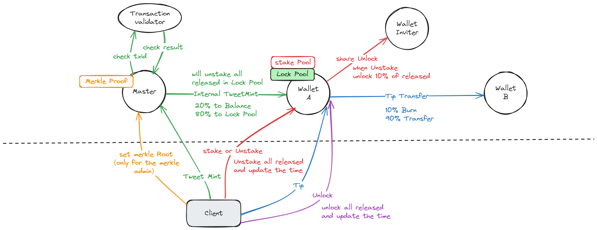

# TweetFi

TweetFi is an innovative social media mining platform that aims to provide social media users with a share to earn channel by combining AI technology and blockchain token economics.


## Contract structure


## TestNet Jetton Master
- v0.0.1 

    [0QCe6-RwMOHP1DR8ZWaOfCvtGhYW8nqij-t65iqQCSK9cA6k](https://testnet.tonviewer.com/kQCe6-RwMOHP1DR8ZWaOfCvtGhYW8nqij-t65iqQCSK9cFNh)

- v0.0.2 修复部分问题，修改邀请奖励逻辑


    [kQAImG1uskTfoiCpiPeBhp0-epIHE36z763cs5RDC9DNgZNW](https://testnet.tonviewer.com/kQAImG1uskTfoiCpiPeBhp0-epIHE36z763cs5RDC9DNgZNW)

- v0.0.3 增加获取当前可解锁及可释放的量的函数，修改释放逻辑，需要claim才会进入钱包

    [kQAf_QpBpgGaj9qRNwxG6OFAbfFTwoQLplZv2F8yvSRXNv_F](https://testnet.tonviewer.com/kQAf_QpBpgGaj9qRNwxG6OFAbfFTwoQLplZv2F8yvSRXNv_F)

- v0.0.4 将挖矿直接解锁的部分计入released，用于claim提取，claim提取中整合unlock和unstake，新增claim amount数据接口，增加当前真lock和真stake数量的接口

    [kQC0koqOyJIjG9IMmG3QjNbseucO9OoW9Zxg6sLzWuRn3WPo](https://testnet.tonviewer.com/kQC0koqOyJIjG9IMmG3QjNbseucO9OoW9Zxg6sLzWuRn3WPoF)


    相关接口：
    ```javascript
    getClaimAmountNow // 获取当前可以claim的数量
    getLockAmountMinusAutoUnlock // 当前真Lock的数量（减掉了自动解锁的部分）
    getStakeAmountMinusAutoUnstake // 当前真Stake的数量 （减掉了自动解除质押的部分）
    ```

- v0.0.5 解锁时间间隔设置为10分钟
    [kQAMs_VEaeYk8_obGEuvARC2e2Cpq4rLtEB4zTfHnCfyqGdQ](https://testnet.tonviewer.com/kQAMs_VEaeYk8_obGEuvARC2e2Cpq4rLtEB4zTfHnCfyqGdQ)

- v0.0.6 修复提取量会大于记录释放量的bug (解锁时间还是10分钟)
    [kQAzveTBvRkmrNvZq_5dOKfnjDKJAqRNT97RUmBmobHofNMi](https://testnet.tonviewer.com/kQAzveTBvRkmrNvZq_5dOKfnjDKJAqRNT97RUmBmobHofNMi)

- v0.0.7 修复分享释放消息无法正确发送的问题,修复分享释放统计未完全问题 (解锁时间还是10分钟)
    [kQB48T0nLAn0DzqNV-ShyRHs6jsyBVklYH7ZBk1G1mgsMWNx](https://testnet.tonviewer.com/0QB48T0nLAn0DzqNV-ShyRHs6jsyBVklYH7ZBk1G1mgsMT60)

- v0.0.8 修复gas超标bug，将默克尔证明改为交易签名的方式
    [kQDlOAuiTdQLpDGKJu3JPZ9cwPwSccYTakoxjoTJVlonNeim](https://testnet.tonviewer.com/kQDlOAuiTdQLpDGKJu3JPZ9cwPwSccYTakoxjoTJVlonNeim)


- main net
    [EQD2YsNVX3AKVnsUmTGZcirABMGU0D4iX4hk8xxb-687wbBp](https://tonviewer.com/EQD2YsNVX3AKVnsUmTGZcirABMGU0D4iX4hk8xxb-687wbBp)


- main net 修复gas超标错误
    [EQA3CSgesvtCjXud0xhNIkaPoN5ijvsAiW43352BRr9-ELLM](https://tonviewer.com/UQA3CSgesvtCjXud0xhNIkaPoN5ijvsAiW43352BRr9-EO8J)


## How to use
```shell
npm install
```
### Build

```shell
npm run build
```

### Test

```shell
npm run test
```

### Deploy or run another script

```shell
npm run start
```

## Tutorial

1.1 设置Merkle Tree Admin Address（该地址有权设置Merkle Tree Root）
```js
await tf.send(
        provider.sender(),
        {
            value: toNano('0.02'),
        },
        {
            $$type: "MerkleAdmin",
            value: Address.parse("EQDY-uI3LXl12N1cBduBMN911HM3MdPMijWxLnZPOpbMX6Fi")
        }
    );
```
1.2 获取Merkle Tree Admin
```js
const merkle_admin = await tf.getMerkleAdmin()
```