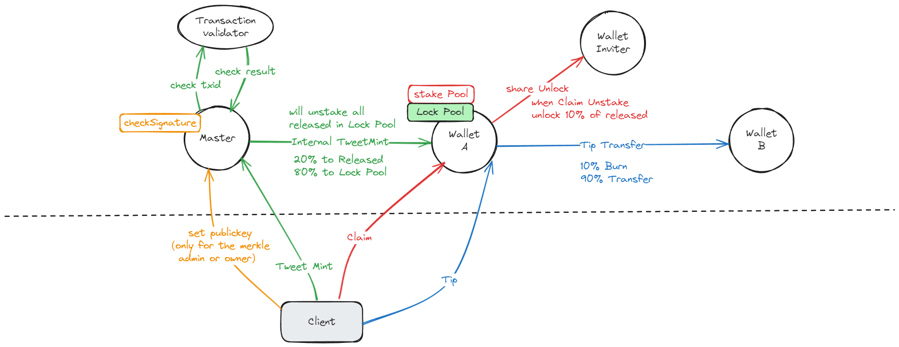

# TweetFi

TweetFi is an innovative social media mining platform that aims to provide social media users with a share to earn channel by combining AI technology and blockchain token economics.


## Contract structure


## TestNet Jetton Master
v0.0.1 [0QCe6-RwMOHP1DR8ZWaOfCvtGhYW8nqij-t65iqQCSK9cA6k](https://testnet.tonviewer.com/kQCe6-RwMOHP1DR8ZWaOfCvtGhYW8nqij-t65iqQCSK9cFNh)

v0.0.2 修复部分问题，修改邀请奖励逻辑
 [kQAImG1uskTfoiCpiPeBhp0-epIHE36z763cs5RDC9DNgZNW](https://testnet.tonviewer.com/kQAImG1uskTfoiCpiPeBhp0-epIHE36z763cs5RDC9DNgZNW)

## How to use
```shell
npm install
```
### Build

```shell
npm run build
```

### Test

```shell
npm run test
```

### Deploy or run another script

```shell
npm run start
```

## Tutorial

1.1 设置Merkle Tree Admin Address（该地址有权设置Merkle Tree Root）
```js
await tf.send(
        provider.sender(),
        {
            value: toNano('0.02'),
        },
        {
            $$type: "MerkleAdmin",
            value: Address.parse("EQDY-uI3LXl12N1cBduBMN911HM3MdPMijWxLnZPOpbMX6Fi")
        }
    );
```
1.2 获取Merkle Tree Admin
```js
const merkle_admin = await tf.getMerkleAdmin()
```